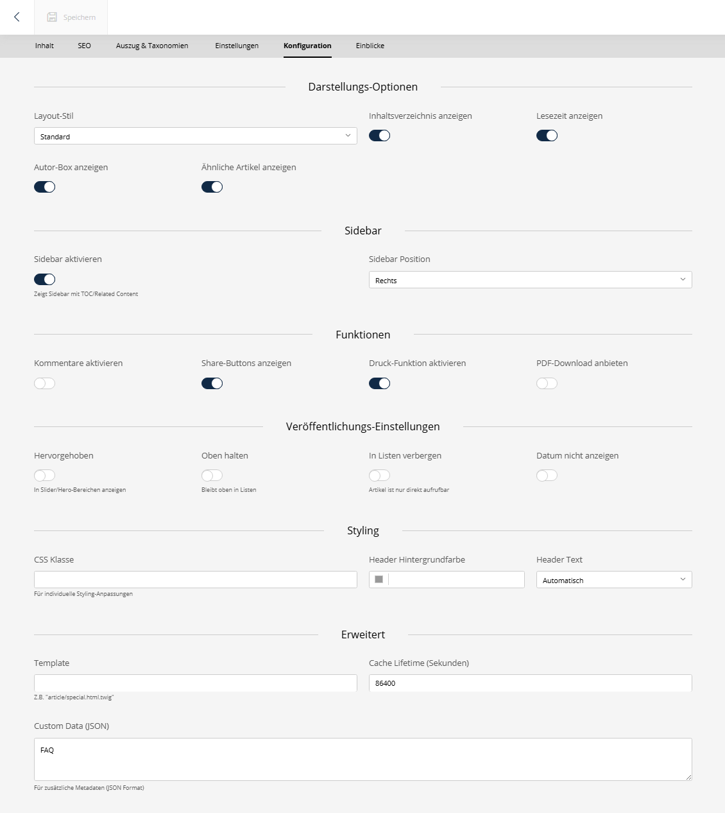

# SuluArticleConfigurationBundle


[](https://github.com/manuxi/SuluArticleConfigurationBundle/LICENSE)


[🇬🇧 English Version](README.md)

Das **SuluArticleConfigurationBundle** erweitert Artikel in Sulu 3.0 um einen umfangreichen "Konfiguration"-Tab. 
Es ermöglicht die Verwaltung zusätzlicher Darstellungsoptionen, Features und Veröffentlichungseinstellungen direkt am Artikel.



## ✨ Features

### 📋 Darstellungs-Optionen
- **Layout-Stil** - Wähle zwischen Standard, Breit, Volle Breite oder Schmal (Reading Mode)
- **Sidebar** - Sidebar aktivieren/deaktivieren und Position (Links/Rechts) bestimmen
- **Elemente anzeigen** - Inhaltsverzeichnis (TOC), Lesezeit, Autor-Box, Ähnliche Artikel

### ⚙️ Funktionen & Features
- **Interaktionen** - Kommentare, Share-Buttons
- **Tools** - Druck-Funktion, PDF-Download

### 🚀 Veröffentlichungs-Einstellungen
- **Highlighting** - "Hervorgehoben" (für Slider/Teaser)
- **Listen-Verhalten** - "Fixiert" (Sticky) oder "Aus Listen ausblenden" (nur direkt aufrufbar)
- **Metadaten** - Veröffentlichungsdatum ausblenden

### 🎨 Styling & Erweitert
- **Design** - Header Hintergrund- und Textfarbe, Custom CSS Klassen
- **Technik** - Custom Template Zuweisung, Cache Lifetime, Custom JSON Data

## 📋 Voraussetzungen

- PHP 8.2 oder höher
- Sulu CMS 3.0 oder höher

## 👩🏻‍🏭 Installation

### Schritt 1: Paket installieren

Füge das Repository zu deiner `composer.json` hinzu (falls lokal) oder installiere es direkt:

```bash
composer require sulu/article-configuration-bundle
```

Falls du *nicht* Symfony Flex verwendest, füge das Bundle in `config/bundles.php` hinzu:

```php
return [
    //...
    Sulu\Bundle\ArticleConfigurationBundle\SuluArticleConfigurationBundle::class => ['all' => true],
];
```

### Schritt 2: Routen konfigurieren

Füge Folgendes zu `config/routes.yaml` hinzu, um die Admin-API-Routen zu laden:

```yaml
sulu_article_configuration_api:
    resource: '@SuluArticleConfigurationBundle/Resources/config/routes_admin.yaml'
```

### Schritt 3: Datenbank aktualisieren

Erstelle die benötigte Tabelle `article_configuration`:

```bash
# Prüfe was erstellt wird
php bin/console doctrine:schema:update --dump-sql

# Führe Migration aus
php bin/console doctrine:schema:update --force
```

## 🎣 Verwendung

1. Navigiere zu **Artikel** in der Sulu-Admin-Navigation.
2. Öffne einen bestehenden Artikel oder erstelle einen neuen.
3. Klicke auf den Tab **Konfiguration**.
4. Wähle die gewünschten Optionen (z.B. "Sidebar aktivieren", "Layout-Stil").
5. Speichere den Artikel.

Die Konfigurationswerte werden in einer separaten Tabelle gespeichert und sind mit dem Artikel verknüpft.

## 📝 Lizenz

Dieses Bundle ist unter der MIT-Lizenz lizenziert. Siehe [LICENSE](LICENSE).
