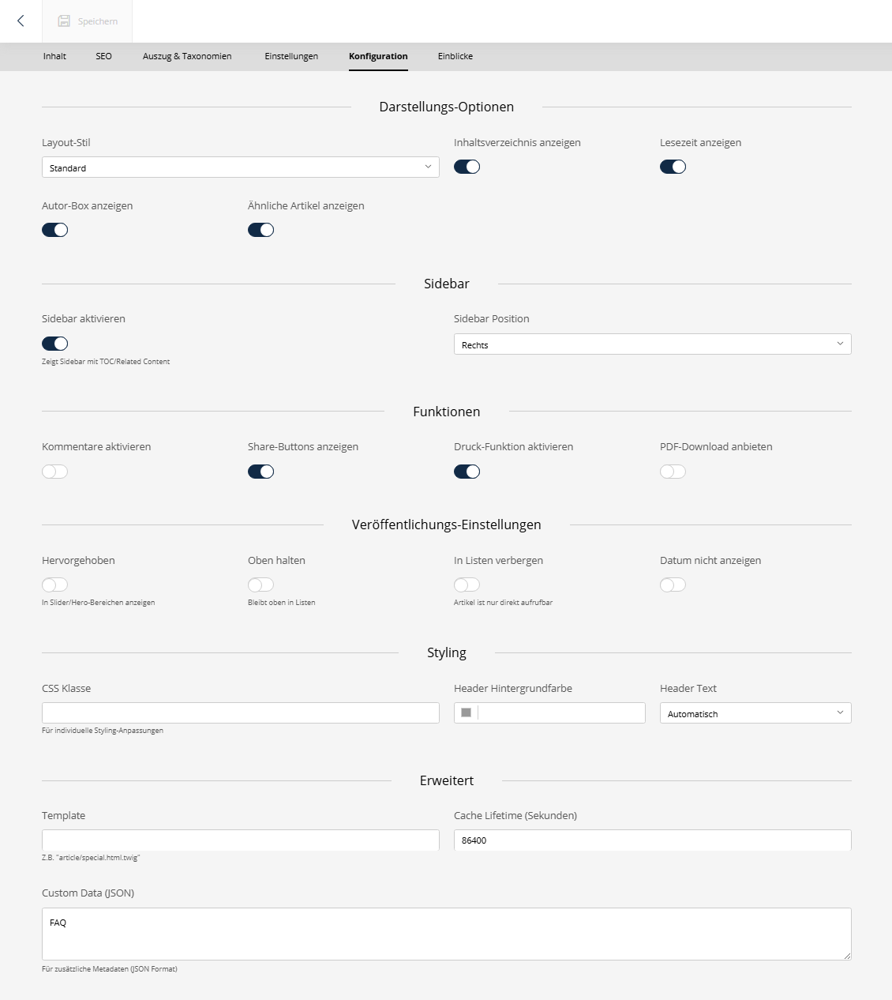

# SuluArticleConfigurationBundle


[](https://github.com/manuxi/SuluArticleConfigurationBundle/LICENSE)


[🇬🇧 English Version](README.md)

Das **SuluArticleConfigurationBundle** erweitert Artikel in Sulu 3.0 um einen umfangreichen "Konfiguration"-Tab.
Es ermöglicht die Verwaltung zusätzlicher Darstellungsoptionen, Features und Veröffentlichungseinstellungen direkt am Artikel.



## ✨ Features

### 📋 Darstellungs-Optionen
- **Layout-Stil** - Wähle zwischen Standard, Breit, Volle Breite oder Schmal (Reading Mode)
- **Sidebar** - Sidebar aktivieren/deaktivieren und Position (Links/Rechts) bestimmen
- **Elemente anzeigen** - Inhaltsverzeichnis (TOC), Lesezeit, Autor-Box, Ähnliche Artikel

### ⚙️ Funktionen & Features
- **Interaktionen** - Share-Buttons
- **Tools** - Druck-Funktion

### 🚀 Veröffentlichungs-Einstellungen
- **Metadaten** - Veröffentlichungsdatum ausblenden

### 🎨 Styling & Erweitert
- **Design** - Custom CSS Klassen

### 🧩 Konfigurierbare Felder
- **Sulu-Formular-XML** - Felder per normalem Sulu-Formular-XML im Projekt hinzufügen, ändern oder entfernen, ohne Datenbank-Änderung
- **Pro Group und pro Template** - Jedes Template kann eigene Felder haben, siehe [docs/configuration.de.md](docs/configuration.de.md)

### 🔄 Standard-Konfiguration für Templates
- **Vererbungs-System** - Setze eine Standard-Konfiguration für alle Artikel desselben Templates
- **3-Stufen-Kaskade** - Artikel-spezifisch → Template-spezifisch → Standardwerte
- **Template-Erkennung** - Der Template-Name wird automatisch erkannt und gespeichert

## 📋 Voraussetzungen

- PHP 8.2 oder höher
- Sulu CMS 3.0 oder höher

## 👩🏻‍🏭 Installation

### Schritt 1: Paket installieren

Füge das Repository zu deiner `composer.json` hinzu (falls lokal) oder installiere es direkt:

```bash
composer require manuxi/sulu-article-configuration-bundle
```

Falls du *nicht* Symfony Flex verwendest, füge das Bundle in `config/bundles.php` hinzu:

```php
return [
    //...
    Manuxi\SuluArticleConfigurationBundle\SuluArticleConfigurationBundle::class => ['all' => true],
];
```

### Schritt 2: Routen konfigurieren

Füge Folgendes zu `config/routes.yaml` hinzu, um die Admin-API-Routen zu laden:

```yaml
sulu_article_configuration_api:
    resource: '@SuluArticleConfigurationBundle/Resources/config/routes_admin.yaml'
```

### Schritt 3: Datenbank aktualisieren

Erstelle die benötigte Tabelle `ar_article_configuration`:

```bash
# Prüfe was erstellt wird
php bin/console doctrine:schema:update --dump-sql

# Führe Migration aus
php bin/console doctrine:schema:update --force
```

## 🎣 Verwendung

### Admin-Oberfläche

1. Navigiere zu **Artikel** in der Sulu-Admin-Navigation.
2. Öffne einen bestehenden Artikel oder erstelle einen neuen (speichern!).
3. Klicke auf den **Konfiguration**-Tab.
4. Wähle die gewünschten Optionen aus (z.B. "Sidebar aktivieren", "Layout-Stil").
5. Speichere die Konfiguration.

### Standard-Konfiguration

Du kannst eine Standard-Konfiguration für alle Artikel mit demselben Template definieren:

1. Öffne einen Artikel mit dem gewünschten Template (z.B. "Blog-Beitrag")
2. Gehe zum **Konfiguration**-Tab
3. Konfiguriere alle Einstellungen wie gewünscht
4. Aktiviere **"Als Standard verwenden"** im Bereich "Standard-Konfiguration"
5. Speichere die Konfiguration.

Nun verwenden alle anderen Artikel mit diesem Template automatisch diese Einstellungen - es sei denn, sie haben eine eigene Konfiguration.

**So funktioniert die Kaskade:**

```
1. Artikel hat eigene Konfiguration? → wird verwendet
2. Es existiert eine Standard-Konfiguration für dieses Template? → wird verwendet
3. Keines von beiden? → hinterlegte Standardwerte werden verwendet
```

### Eigene Felder

Die Felder des Tabs "Konfiguration" werden mit Sulu-Formular-XML definiert. Das Bundle liefert die unten aufgeführten
Felder mit, dein Projekt kann sie ändern oder eigene hinzufügen - für alle Artikel, pro Artikel-Group oder pro
Template. Lege die Dateien in `config/article_configuration/` (wird automatisch registriert):

```
config/article_configuration/
    group_blog.xml            <key>article_configuration_group_blog</key>
    template_blog_post.xml    <key>article_configuration_template_blog_post</key>
```

Die Dateien enthalten nur die Unterschiede zur vorherigen Ebene. Eine neue `<property>` fügt ein Feld hinzu, eine
Property mit gleichem Namen ersetzt es, und `<tag name="article_configuration.remove"/>` entfernt es:

```xml
<section name="display_options">
    <properties>
        <property name="showToc" type="checkbox">
            <tag name="article_configuration.remove"/>
        </property>
    </properties>
</section>
```

Die Werte werden als JSON gespeichert, ein neues Feld braucht also nie ein Schema-Update. Ebenen, Werte-Typen,
Übersetzungen und ein vollständiges Beispiel stehen in [docs/configuration.de.md](docs/configuration.de.md).

### Frontend-Nutzung (Twig)

Das Bundle stellt eine Twig-Funktion bereit, um die Konfiguration in Twig-Templates bereit zu stellen:

```twig
{# Konfiguration holen #}


{# Oder via Alias #}


{# Konfigurationswerte verwenden #}
<article class="article article--{{ articleConfig.layoutStyle }} {{ articleConfig.customCssClass }}">
    
    
        <span class="reading-time">{{ reading_time }} Min. Lesezeit</span>
    
    
    
        <nav class="table-of-contents">
            {# ... TOC Inhalt ... #}
        </nav>
    
    
    <div class="article__content">
        {{ content|raw }}
    </div>
    
    
        <div class="author-box">
            {# ... Autor-Info ... #}
        </div>
    
    
    
        <section class="related-articles">
            {# ... Ähnliche Artikel ... #}
        </section>
    
    
    
        <div class="share-buttons">
            {# ... Share-Buttons ... #}
        </div>
    
    
</article>

{# Prüfen, woher die Config kommt #}

    <!-- Verwendet Konfiguration aus Artikel {{ articleConfig.templateDefaultArticleId }} -->

```

**Verfügbare Konfigurationswerte** (die mitgelieferten Felder; dein Schema kann Felder hinzufügen oder entfernen, `hardcoded` bedeutet die Standardwerte des Schemas):

| Eigenschaft | Typ | Standard | Beschreibung |
|-------------|-----|----------|--------------|
| `layoutStyle` | string | `'fullwidth'` | `default`, `wide`, `fullwidth`, `narrow` |
| `enableSidebar` | bool | `true` | Sidebar anzeigen |
| `sidebarPosition` | string | `'right'` | `left`, `right` |
| `showToc` | bool | `true` | Inhaltsverzeichnis anzeigen |
| `showReadingTime` | bool | `true` | Lesezeit anzeigen |
| `showAuthorBox` | bool | `true` | Autor-Box anzeigen |
| `showRelated` | bool | `true` | Ähnliche Artikel anzeigen |
| `enableShareButtons` | bool | `true` | Teilen-Buttons anzeigen |
| `enablePrint` | bool | `true` | Drucken-Button anzeigen |
| `hidePublishDate` | bool | `false` | Veröffentlichungsdatum verbergen |
| `customCssClass` | string | `null` | Eigene CSS-Klasse |
| `configSource` | string | - | `article`, `template_default`, `hardcoded` |

**Beispiel: Bedingtes Sidebar-Layout**

```twig


<div class="layout layout--{{ articleConfig.layoutStyle }}">
    
        <div class="layout__sidebar layout__sidebar--{{ articleConfig.sidebarPosition }}">
            
                {{ render_toc(content) }}
            
        </div>
    
    
    <main class="layout__main">
        {{ content|raw }}
    </main>
</div>
```

**Beispiel: Eigene CSS-Klasse**

```twig


<header class="article-header {{ articleConfig.customCssClass }}">
    <h1>{{ article.title }}</h1>
</header>
```

### Template eines Artikels per URL auflösen

`article_configuration`/`article_config` brauchen den eigenen `templateKey` des Artikels, der beim Rendern der
eigenen Artikelseite trivial verfügbar ist. Über die `properties`-Zuordnung eines `smart_content`-/Auswahl-Feldes
lässt er sich aber nicht erreichen (das Feld liegt in den internen "view"-Daten der Ressource, die
`recursivelyMapProperties()` nie mitmappt) – z. B. ein "Artikel"-Sammelfeld auf einer Seite oder einem anderen
Artikel, wo jedes Element nur Titel/Untertitel/URL/Bild liefert, würde ihn immer vermissen.

`article_template_key(url, locale)` löst ihn stattdessen über die URL des Artikels auf (über die Routen-Tabelle)
– funktioniert also genau in dieser Situation. Gibt `null` zurück, wenn die URL zu keinem veröffentlichten Artikel
führt.

```twig


    <span class="badge">{{ templateKey }}</span>

```

Mit einer eigenen Template-zu-Farbe/-Bezeichnung-Zuordnung kombinieren (z. B. eine projektweite Farbpalette), um
Artikel in einer Liste nach ihrem Template zu kennzeichnen – das Bundle löst nur den Schlüssel auf, hat aber
keine Meinung zu Farben oder Bezeichnungen.

## ⬆️ Umstieg von 2.x

3.0 speichert die Werte als JSON statt in festen Spalten. Datenbank-Backup anlegen, dann die Daten kopieren, **bevor**
die alten Spalten entfernt werden:

```bash
php bin/adminconsole sulu:article-configuration:migrate-to-json --dry-run
php bin/adminconsole sulu:article-configuration:migrate-to-json
php bin/adminconsole sulu:article-configuration:migrate-to-json --drop-legacy-columns
```

Details und die Liste der Breaking Changes: [docs/configuration.de.md](docs/configuration.de.md) und [CHANGELOG.md](CHANGELOG.md).

## ⬆️ Umstieg von 1.x

2.0 entfernt die PDF-Schalter (`enableDownloadPdf`, `pdfShowCaptions`, `pdfShowAuthor`, `pdfShowModified`, `pdfShowOnlineLink`, `pdfCompanyData`) aus dem Tab "Konfiguration". Sie liegen jetzt im **Reiter "Auszug"** des Artikels, geliefert von [manuxi/sulu-pdf-bundle](https://github.com/manuxi/SuluPdfBundle) (1.3+) - pro Sprache und mit Entwurf/Veröffentlichen:

```yaml
sulu_pdf:
    excerpt:
        articles: true
```

Ersetzen Sie `articleConfig.enableDownloadPdf` in Ihren Templates durch `sulu_pdf_available('articles', uuid, app.request.locale)`, führen Sie `bin/adminconsole doctrine:schema:update --force` aus, um die Spalten zu entfernen, und setzen Sie die Schalter im Reiter "Auszug" neu.

## 🗄️ Datenbank-Schema

Das Bundle erstellt folgende Tabelle:

```sql
CREATE TABLE ar_article_configuration (
    id INT AUTO_INCREMENT PRIMARY KEY,
    article_id VARCHAR(36) UNIQUE NOT NULL,
    template_key VARCHAR(128) DEFAULT NULL,
    is_default TINYINT(1) DEFAULT 0 NOT NULL,
    data JSON DEFAULT NULL,
    INDEX idx_template_default (template_key, is_default)
);
```

## 🧪 Tests

```bash
composer test
```

## 📄 Lizenz

Dieses Bundle steht unter der MIT-Lizenz. Die vollständige Lizenz findest du im Bundle: [LICENSE](LICENSE)

## 👤 Autor

**Manuel Bertrams**
- GitHub: [@manuxi](https://github.com/manuxi)